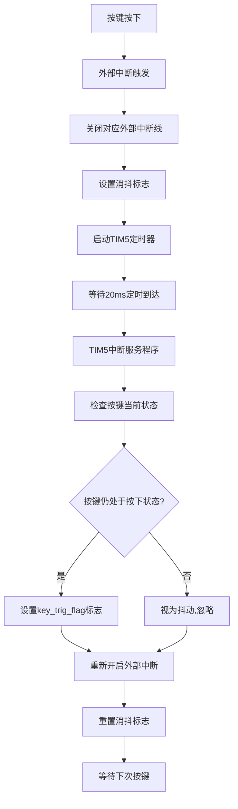

# STM32 TIM5定时器中断实现分析

## 1. 概述

在当前的按键驱动系统中，TIM5定时器被用作按键消抖的定时器。当外部中断被触发时，系统会立即关闭相应的外部中断线以防止按键抖动引起的重复触发，然后启动TIM5定时器进行延时消抖确认。在定时器中断服务程序中，会对按键状态进行最终确认，如果确认是有效按键按下，则设置相应的标志位。

## 2. 定时器初始化

### 2.1 初始化函数
```c
int8_t KEY_Debounce_Timer_Init(void)
```

### 2.2 配置参数
- **定时器**: TIM5
- **时钟频率**: 系统时钟168MHz，APB1分频后84MHz
- **预分频器**: 84-1，得到1MHz计数频率
- **周期值**: 20000-1，实现20ms定时
- **计数模式**: 向上计数模式
- **中断类型**: 更新中断(TIM_IT_Update)
- **默认状态**: 初始化后关闭，仅在外部中断触发时启用

### 2.3 中断配置
- **中断通道**: TIM5_IRQn
- **抢占优先级**: 6
- **子优先级**: 0
- **中断使能**: 使能

## 3. 中断触发流程

### 3.1 外部中断触发
当按键按下时，会触发外部中断，执行以下操作：
1. 清除外部中断挂起位
2. 关闭当前外部中断线，防止抖动重复触发
3. 设置[key_pending_check](file:///mnt/d/codeStudy/c/stm32/study/day2/code/按钮控制led/User/key.c#L31-L31)为当前按键编号
4. 设置[key_debounce_active](file:///mnt/d/codeStudy/c/stm32/study/day2/code/按钮控制led/User/key.c#L30-L30)为1，表示正在消抖
5. 启动TIM5定时器

### 3.2 定时器中断处理
```c
void TIM5_IRQHandler(void)
```

当TIM5计数达到设定值(20ms)时，会触发定时器更新中断，执行以下操作：

1. 检查中断状态并清除中断挂起位
2. 关闭TIM5定时器
3. 检查是否正在进行消抖处理
4. 读取按键当前电平状态
5. 如果按键仍然处于按下状态(低电平)，则认为是有效按键：
   - 设置[key_trig_flag](file:///mnt/d/codeStudy/c/stm32/study/day2/code/按钮控制led/User/key.c#L24-L24)对应位，标记按键触发事件
6. 重新开启对应的外部中断线
7. 重置消抖相关标志位

## 4. 关键变量说明

| 变量名 | 类型 | 作用 |
|--------|------|------|
| [key_debounce_active](file:///mnt/d/codeStudy/c/stm32/study/day2/code/按钮控制led/User/key.c#L30-L30) | volatile uint8_t | 标记是否正在进行消抖处理 |
| [key_pending_check](file:///mnt/d/codeStudy/c/stm32/study/day2/code/按钮控制led/User/key.c#L31-L31) | volatile uint8_t | 记录需要确认的按键编号 |
| [key_trig_flag](file:///mnt/d/codeStudy/c/stm32/study/day2/code/按钮控制led/User/key.c#L24-L24) | volatile uint8_t | 按键触发标志，每个位对应一个按键 |

## 5. 时序分析

```
按键按下 → 外部中断触发 → 关闭外部中断 → 启动TIM5定时器
    ↓
TIM5定时20ms到达 → 定时器中断触发 → 检查按键状态
    ↓
按键仍处于按下状态 → 确认为有效按键 → 设置key_trig_flag
    ↓
重新开启外部中断 → 重置消抖标志 → 等待下次按键
```

## 6. 优势分析

1. **避免重复触发**: 在外部中断触发后立即关闭中断，有效防止按键抖动引起的重复触发
2. **非阻塞设计**: 使用定时器中断进行延时确认，不会阻塞主程序运行
3. **硬件定时**: 利用硬件定时器实现精确延时，比软件延时更准确
4. **优先级控制**: 为定时器中断设置了合适的优先级，确保及时响应

## 7. 工作流程图



## 8. 总结

TIM5定时器中断在按键消抖系统中起到了关键作用，通过硬件定时实现精确的20ms延时确认，有效区分真实按键操作和抖动干扰。这种设计既保证了按键识别的准确性，又避免了软件延时对系统实时性的影响。