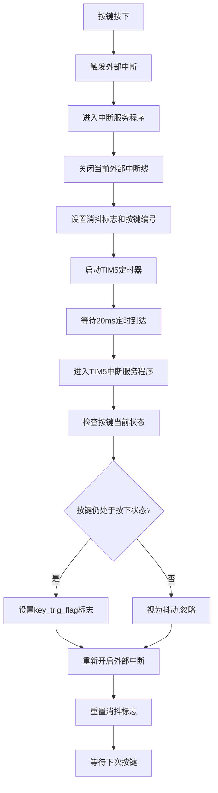

# STM32 按键外部中断实现分析

## 1. 概述

当前按键驱动系统使用外部中断（EXTI）结合定时器消抖的方式来检测按键按下事件。当按键按下时，会触发外部中断，然后通过定时器延时确认按键状态，避免抖动干扰。这种设计能够实时响应按键操作，同时保证识别的准确性。

## 2. 按键硬件连接

系统中共有4个按键：
- KEY0: 连接到 PA0 引脚
- KEY1: 连接到 PE2 引脚
- KEY2: 连接到 PE3 引脚
- KEY3: 连接到 PE4 引脚

按键采用下拉模式设计，按下时为低电平（0），释放时为高电平（1）。

## 3. 外部中断初始化

### 3.1 初始化函数
```c
int8_t KEY_EXTI_Init(void)
```

### 3.2 配置参数
- **中断触发方式**: 下降沿触发（EXTI_Trigger_Falling）
- **中断模式**: 中断模式（EXTI_Mode_Interrupt）
- **中断优先级**: 抢占优先级5，子优先级5

### 3.3 各按键中断线配置
| 按键 | GPIO端口 | 引脚 | 中断线 |
|------|---------|------|--------|
| KEY0 | GPIOA   | PA0  | EXTI_Line0 |
| KEY1 | GPIOE   | PE2  | EXTI_Line2 |
| KEY2 | GPIOE   | PE3  | EXTI_Line3 |
| KEY3 | GPIOE   | PE4  | EXTI_Line4 |

## 4. 中断处理流程

### 4.1 外部中断服务程序
每个按键对应一个中断服务程序：
- KEY0: EXTI0_IRQHandler
- KEY1: EXTI2_IRQHandler
- KEY2: EXTI3_IRQHandler
- KEY3: EXTI4_IRQHandler

所有中断服务程序都调用同一个处理函数：
```c
static void KEY_EXTI_Trigger_Debounce(uint8_t key_num, uint32_t exti_line)
```

### 4.2 中断处理步骤
1. 检查中断状态并清除中断挂起位
2. 关闭当前外部中断线，防止抖动重复触发
3. 设置[key_pending_check](file:///mnt/d/codeStudy/c/stm32/study/day2/code/按钮控制led/User/key.c#L31-L31)为当前按键编号
4. 设置[key_debounce_active](file:///mnt/d/codeStudy/c/stm32/study/day2/code/按钮控制led/User/key.c#L30-L30)为1，表示正在消抖
5. 启动TIM5定时器进行20ms延时确认

## 5. 关键变量说明

| 变量名 | 类型 | 作用 |
|--------|------|------|
| [key_interrupt_flag](file:///mnt/d/codeStudy/c/stm32/study/day2/code/按钮控制led/User/key.c#L22-L22) | volatile uint8_t | 按键中断标志 |
| [key_interrupt_value](file:///mnt/d/codeStudy/c/stm32/study/day2/code/按钮控制led/User/key.c#L23-L23) | volatile uint8_t | 按键中断值 |
| [key_trig_flag](file:///mnt/d/codeStudy/c/stm32/study/day2/code/按钮控制led/User/key.c#L24-L24) | volatile uint8_t | 按键触发标志，每个位对应一个按键 |
| [key_debounce_active](file:///mnt/d/codeStudy/c/stm32/study/day2/code/按钮控制led/User/key.c#L30-L30) | volatile uint8_t | 标记是否正在进行消抖处理 |
| [key_pending_check](file:///mnt/d/codeStudy/c/stm32/study/day2/code/按钮控制led/User/key.c#L31-L31) | volatile uint8_t | 记录需要确认的按键编号 |

## 6. 按键识别流程



## 7. 按键值获取函数

### 7.1 KEY_Get_Interrupt_Value
```c
uint8_t KEY_Get_Interrupt_Value(void)
```
用于获取中断触发的按键值，通过检查[key_interrupt_flag](file:///mnt/d/codeStudy/c/stm32/study/day2/code/按钮控制led/User/key.c#L22-L22)标志来判断是否有按键按下。

### 7.2 KEY_Get_Trig_Flag
```c
static inline uint8_t KEY_Get_Trig_Flag(void)
```
用于获取定时器消抖确认后的按键触发事件，通过检查[key_trig_flag](file:///mnt/d/codeStudy/c/stm32/study/day2/code/按钮控制led/User/key.c#L24-L24)标志来判断。这是推荐使用的按键检测方法。

## 8. 优势分析

1. **实时性强**: 使用外部中断触发，能够及时响应按键操作
2. **防抖动**: 通过定时器延时确认，有效消除按键抖动影响
3. **非阻塞**: 中断处理过程不阻塞主程序运行
4. **优先级控制**: 为按键中断设置了合适的优先级，避免影响系统其他关键任务
5. **资源优化**: 在消抖期间关闭外部中断，防止重复触发

## 9. 注意事项

1. **中断嵌套**: 按键中断优先级设置为中等（抢占优先级5），避免影响更高优先级的中断处理
2. **资源占用**: 每个按键使用独立的中断线，占用较多中断资源
3. **电平触发**: 当前采用下降沿触发，适用于低电平有效的按键设计

## 10. 总结

当前按键外部中断实现方案通过"外部中断触发+定时器消抖确认"的方式，实现了准确、实时的按键检测功能。该方案能够有效避免按键抖动问题，同时保证系统的实时性，是一种较为优秀的按键处理方案。